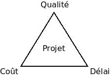

# Le génie logiciel

L'objectif de ce chapitre est de présenter le génie logiciel, ses enjeux et ses dimensions.

## Introduction

Le **génie logiciel** (*software engineering*) représente l'application de principes d'[ingénierie](https://fr.wikipedia.org/wiki/Ing%C3%A9nierie) au domaine de la création de logiciels. Il consiste à identifier et à utiliser des **méthodes**, des **pratiques** et des **outils** permettant de maximiser les chances de réussite d'un projet logiciel.

Il s'agit d'une science récente dont l'origine remonte des années 1970. A cette époque, l'augmentation de la puissance matérielle a permis de réaliser des logiciels plus complexes mais souffrant de nouveaux défauts : délais non respectés, coûts de production et d'entretien élevés, manque de fiabilité et de performances. Cette tendance se poursuit encore aujourd'hui.

L'apparition du génie logiciel est une réponse aux défis posés par la complexification des logiciels et de l'activité qui vise à les produire.

## Enjeux

Le génie logiciel vise à rationaliser et à optimiser le processus de production d'un logiciel. Les enjeux associés sont multiples :

* Adéquation aux besoins du client.
* Respect des délais de réalisation prévus.
* Maximisation des performances et de la fiabilité.
* Facilitation de la maintenance et des évolutions ultérieures.

Comme tout projet, la réalisation d'un logiciel est soumise à des exigences contradictoires et difficilement conciliables ([coût-délai-qualité](http://www.geek-directeur-technique.com/2009/07/10/le-triangle-qualite-cout-delai)), souvent représentées sous forme d'un triangle.

La qualité d'un logiciel peut s'évaluer à partir d'un ensemble de facteurs tels que :

* Le logiciel répond-il aux besoins exprimés ?
* Le logiciel demande-t-il peu d'efforts pour évoluer aux regards de nouveaux besoins ?
* Le logiciel peut-il facilement être transféré d'une plate-forme à une autre ?
* ... (voir norme [ISO 9126](http://fr.wikipedia.org/wiki/ISO_9126))

La qualité du code source d'un logiciel peut être évaluée par un certain nombre de mesures appelées **métriques de code** : indice de maintenabilité, complexité cyclomatique, etc.

Sans être une [solution miracle](https://fr.wikipedia.org/wiki/Pas_de_balle_en_argent), le génie logiciel est un moyen de maximiser la surface du triangle en tenant compte des priorités du client.

## Dimensions

Le génie logiciel couvre l'ensemble du cycle de vie d'un logiciel. Il étudie toutes les activités qui mènent d'un besoin à la livraison du logiciel, y compris dans ses versions successives.

Les dimensions du génie logiciel sont donc multiples :

* Analyse des besoins du client.
* Conception, c'est-à-dire l'ensemble des choix qui vont structurer le logiciel.
* Règles et méthodes de production du code source.
* Tests du logiciel.
* Intégration et validation.
* Gestion des versions.
* Maintenance et évolutions.
* Organisation de l'équipe et interactions avec le client.
* ...

Ce livre présente plus en détail certaines de ces activités. 
