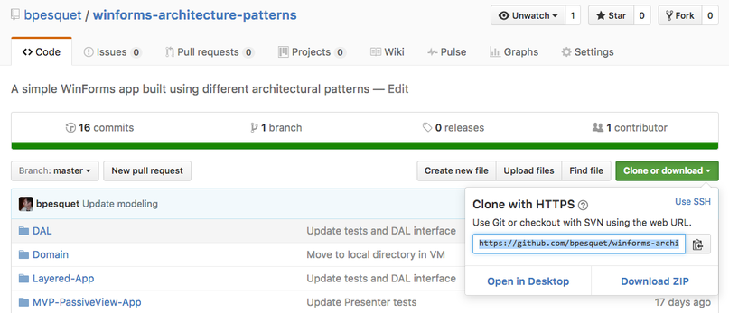
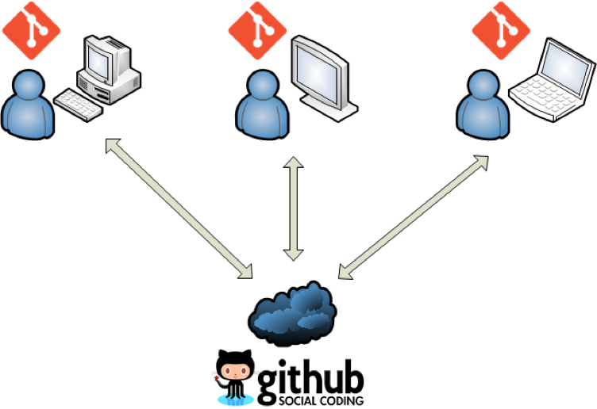
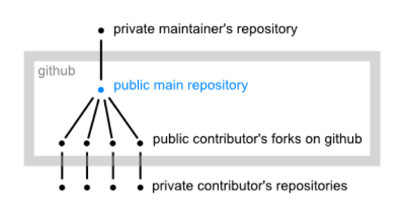
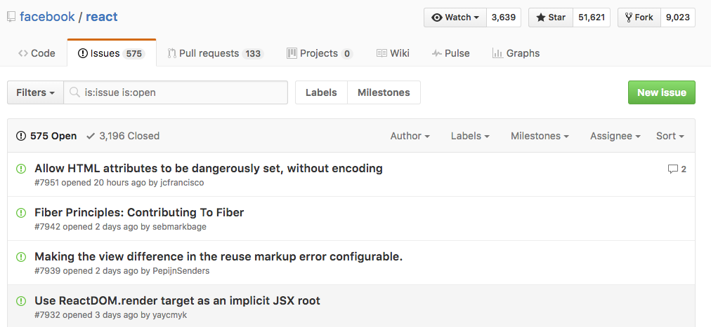

# Travail collaboratif

L'objectif de ce chapitre est de présenter les enjeux du travail collaboratif dans le cadre de la réalisation d'un logiciel.

## Les enjeux du travail collaboratif

La très grande majorité des projets logiciels sont menés par des équipes de plusieurs développeurs. Il est de plus en plus fréquent que ces développeurs travaillent à distance ou en mobilité.

Le travail en équipe sur un projet logiciel nécessite de pouvoir :

* Partager le code source entre membres de l'équipe.
* Gérer les droits d'accès au code.
* Intégrer les modifications réalisées par chaque développeur.
* Signaler des problèmes ou proposer des améliorations qui peuvent ensuite être discutés collectivement.

Pour répondre à ces besoins, des plates-formes de publication et de partage de code en ligne sont apparues. On les appelle parfois des **forges logicielles**. La plus importante à l'heure actuelle est la plate-forme GitHub.

## Présentation de GitHub

[GitHub](https://github.com) est une plate-forme web d'hébergement et de partage de code. Comme son nom l'indique, elle se base sur le logiciel Git.

Le principal service proposé par GitHub est la fourniture de dépôts Git accessibles en ligne. Elle offre aussi une gestion des équipes de travail (*organizations* et *teams*), des espaces d'échange autour du code (*issues* et *pull requests*), des statistiques, etc.

GitHub est utilisée par pratiquement toutes les grandes sociétés du monde du logiciel, y compris [Microsoft](https://github.com/Microsoft), [Facebook](https://github.com/facebook) et [Apple](https://github.com/apple). Pour un développeur, GitHub peut constituer une vitrine en ligne de son travail et un atout efficace pour son employabilité.

### Modèle économique

Le *business model* de GitHub est le suivant :

* La création d'un compte et de dépôts publics sont gratuites.
* La création de dépôts privés est payante.

Ce modèle économique est à l'origine de l'énorme popularité de GitHub pour la publication de projets *open source*.

> GitHub peut offrir des dépôts privés gratuits aux étudiants et aux établissements scolaires.

D'autres plates-formes alternatives se basent sur un modèle différent :

* [BitBucket](https://bitbucket.org/) autorise les dépôts privés gratuits mais limite la taille de l'équipe à 5 personnes.
* [GitLab](https://about.gitlab.com/) est une solution *open core* pour installer sur ses propres serveurs une plate-forme similaire à GitHub.

### Fonctionnement

Sur GitHub, un dépôt est associé à un utilisateur individuel ou à une organisation. Il est ensuite accessible via une URL de la forme `https://github.com/.../nomDuDepot.git`.

L'organisation du travail en équipe autour de GitHub peut se faire suivant deux modèles distincts.

#### Modèle "dépôt partagé"

Ce modèle de travail est bien adapté aux petites équipes et aux projets peu complexes.

Un dépôt GitHub fait office de dépôt central pour l'équipe. Après avoir obtenu les droits nécessaires, chaque développeur clone ce dépôt (`git clone`) sur sa machine de travail. Ensuite, chacun peut envoyer ses modifications locales vers le dépôt commun (`git push`) et récupérer celles des autres membres de l'équipe (`git pull`).

#### Modèle "fork and pull"

Ce modèle plus complexe est utilisé sur des projets de taille importante.

Un dépôt GitHub principal est *forké* par chaque développeur pour en obtenir une copie exacte sur son compte GitHub, puis cloné sur sa machine locale. Les modifications sont *pushées* sur GitHub, puis le développeur émet une demande d'intégration (*pull request*) pour signaler au responsable du dépôt commun qu'il a effectué des améliorations de son côté. Ce responsable étudie le code ajouté et décide de l'intégrer ou non dans le dépôt principal.

### Issues

Parmi les autres services proposés par GitHub, les *issues* ("sujets de discussion") permettent de communiquer autour du projet. Elles sont souvent utilisées pour signaler des problèmes ou proposer des idées.

