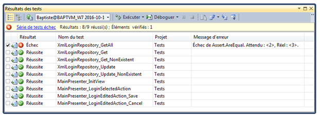

# Tests

L'objectif de ce chapitre est de présenter le rôle des tests dans le processus de création d'un logiciel.

## Pourquoi tester ?

La problématique des tests est souvent considérée comme secondaire et négligée par les développeurs. C'est une erreur : lorsqu'on livre une application et qu'elle est placée en production (offerte à ses utilisateurs), il est essentiel d'avoir un maximum de garanties sur son bon fonctionnement afin d'éviter au maximum de coûteuses mauvaises surprises.

Le test d'une application peut être manuel. Dans ce cas, une personne effectue sur l'application une suite d'opérations prévue à l'avance (navigation, connexion, envoi d'informations...) pour vérifier qu'elle possède bien le comportement attendu. C'est un processus coûteux en temps et sujets aux erreurs (oublis, négligences, etc).

En complément de ces tests manuels, on a tout intérêt à intégrer à un projet logiciel des tests automatisés qui pourront être lancés aussi souvent que nécessaire. Ceci est d'autant plus vrai pour les méthodologies agiles basées sur un développement itératif et des livraisons fréquentes, ou bien lorsque l'on met en place une [intégration continue](https://fr.wikipedia.org/wiki/Int%C3%A9gration_continue).

## Comment tester ?

On peut classer les tests logiciels en différentes catégories.

### Tests de validation

Ces tests sont réalisés lors de la [recette](https://fr.wikipedia.org/wiki/Test_d%27acceptation) (validation) par un client d'un projet livré par l'un de ses fournisseurs. Souvent écrits par le client lui-même, ils portent sur l'ensemble du logiciel et permet de vérifier son comportement global en situation.

De part leur spectre large et leur complexité, les tests de validation sont le plus souvent manuels. Les procédures à suivre sont regroupées dans un document associé au projet, fréquemment nommé plan de validation.

### Tests d'intégration

Dans un projet informatique, l'intégration est de fait d'assembler plusieurs composants (ou modules) élémentaires en un composants de plus haut niveau. Un [test d'intégration](http://www.test-recette.fr/tests-techniques/bases/tests-integration.html) valide les résultats des interactions entre plusieurs composants et permet de vérifier que leur assemblage s'est produit sans défaut. Il peut être manuel ou automatisé.

Un nombre croissant de projets logiciels mettent en place un processus d'**intégration continue**. Cela consiste à vérifier que chaque modification ne produit pas de régression dans l'application développée. L'intégration continue est nécessairement liée à une batterie de tests qui se déclenchent automatiquement lorsque des modifications sont intégrées au code du projet.

### Tests unitaires

Contrairement aux tests de validation et d'intégration qui testent des pans entiers d'un logiciel, un test unitaire na valide qu'une portion atomique du code source (exemple : une seule classe) et est systématiquement automatisé.

Le test unitaire offre les avantages suivants :

* Il est facile à écrire. Dédié à une partie très réduite du code, le test unitaire ne nécessite le plus souvent qu'un contexte minimal, voire pas de contexte du tout.
* Il offre une granularité de test très fine et permet de valider exhaustivement le comportement de la partie du code testée (cas dégradés, saisie d'informations erronées...).
* Son exécution est rapide, ce qui permet de le lancer très fréquemment (idéalement à chaque modification du code testé).
* Il rassemble les cas d'utilisation possibles d'une portion d'un projet et représente donc une véritable documentation sur la manière de manipuler le code testé.

L'ensemble des tests unitaires d'un projet permet de valider unitairement une grande partie de son code source et de détecter le plus tôt possibles d'éventuelles erreurs.

L'image ci-dessous illustre le résultat du lancement de tests unitaires sous Visual Studio.

> Certaines méthodologies de développement logiciel préconisent l'écriture des tests unitaires avant celle du code testé (TDD, *Test Driven Developement*).

## Création de test doubles

En pratique, très peux de parties d'un projet fonctionnent de manière autonome, ce qui complique l'écriture des tests unitaires. Par exemple, comment tester unitairement une classe qui collabore avec plusieurs autres pour réaliser ses fonctionnalités ?

La solution consiste à créer des éléments qui simulent le comportement des collaborateurs d'une classe donnée, afin de pouvoir tester le comportement de cette classe dans un environnement isolé et maîtrisé. Ces éléments sont appelés des **test doubles**.

> Un couplage faible au sein du projet (voir [ce chapitre](03-principes-conception.md)) facilite l'écriture de *test doubles*.

Selon la complexité du test à écrire, un *test double* peut être :

* Un **dummy**, élément basique sans aucun comportement, juste là pour faire compiler le code lors du test.
* Un **stub**, qui renvoie des données permettant de prévoir les résultats attendus lors du test.
* Un **mock**, qui permet de vérifier finement le comportement de l'élément testé (ordre d'appel des méthodes, paramètres passés, etc).
